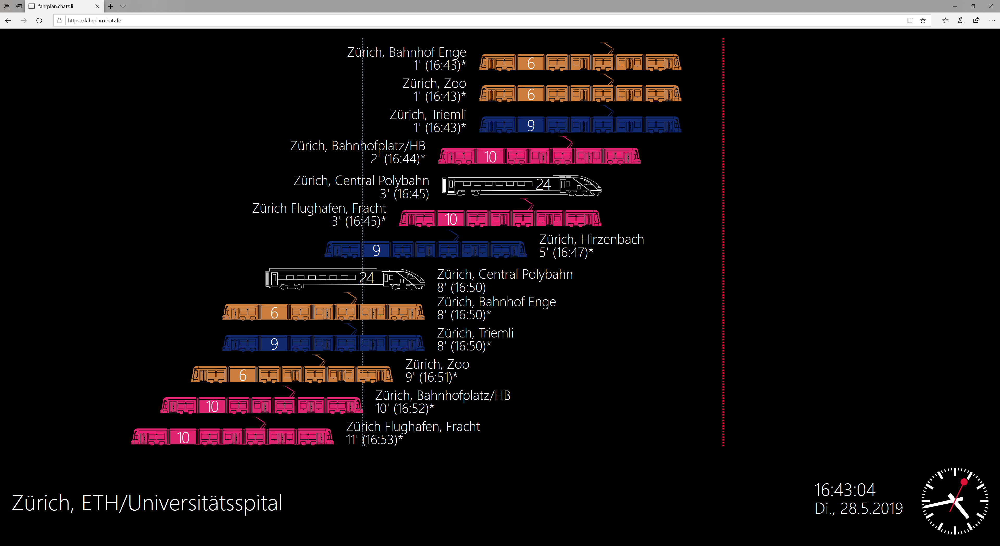

# fahrplan by Technokrat GmbH
`fahrplan` is a dynamic, visual station departure schedule (aka *Fahrplan*) for **Swiss public transport service** (SBB, Postauto, etc.) based on [Meteor.js 1.8.1](https://www.meteor.com/)

We developed `fahrplan` in our free time during our study years and installed a signage monitor in our living community. Currently we are offering our consulting and engineering services at [https://technokrat.ch](https://technokrat.ch). Please visit us if you need fast & reliable full-stack engineering services in electrical engineering, rapid prototyping, MVPs or feasibility research, in a one-stop way.

See [**https://fahrplan.chatz.li**](https://fahrplan.chatz.li) for a live demonstration.



## Usage

To select a station:

1. Hit any key and type in the station name in the query field popping up.
If no station is found, just hit enter once again also crawl through the public database.
2. Select the station on the list with a click

Alternatively use the URL GET parameter `?ibnr=12345678`, which will set the IBNR directly. This is especially useful for kiosk mode operation.

## Self-Hosting
You might host your own `fahrplan` instance for non-commercial purposes.

### Quickstart
For a quickstart, build the Docker image and run docker-compose. This can simply be done with:

```sh
git clone https://github.com/technokrat-llc/fahrplan.git
cd fahrplan
./run_in_docker.sh
```

Your `fahrplan` instance should then be running under http://localhost:3000

Requirements such as Docker and Meteor.js are automatically downloaded by the script.

### Development
`fahrplan` is supported on all machines that can run [Meteor.js](https://www.meteor.com/), 
a Node.js based distributed-reactivity web framework, and [MongoDB](https://www.mongodb.com/).

Install them and run 

```sh
meteor run
```

inside the cloned repository.


#### VirtualHost and Proxy
You can configure a webserver such as Nginx to proxy traffic to your instance.
Take the following configuration as an example:

```nginx
server {
  listen [::]:80;
  listen 80;

  server_name fahrplan.chatz.li;

  return 301 https://$server_name$request_uri;
}

server {
  listen [::]:443 ssl http2;
  listen 443 ssl http2;

  server_name fahrplan.chatz.li;

  ssl on;
  ssl_certificate /etc/letsencrypt/live/chatz.li/fullchain.pem;
  ssl_certificate_key /etc/letsencrypt/live/chatz.li/privkey.pem;
  add_header Strict-Transport-Security "max-age=63072000; includeSubdomains; ";

  location ^~ /.well-known {
    default_type "text/plain";
    root /var/www/html;
  }

  location / {
    proxy_pass http://localhost:3000;
    proxy_http_version 1.1;
    proxy_set_header Upgrade $http_upgrade;
    proxy_set_header Connection "upgrade";
    proxy_set_header Host $host;
  }
}
```

### Useful Links
* [Setup Kiosk mode on RPi3 Raspbian Stretch](https://itrig.de/index.php?/archives/2309-Raspberry-Pi-3-Kiosk-Chromium-Autostart-im-Vollbildmodus-einrichten.html)

### Contact
Please don't hesitate if you encounter a bug or want to contribute.

You reach us through GitHub, our website https://technokrat.ch and by email at contact@technokrat.ch

Apropos: We are always searching for multi-talents in the field of electrical engineering, 
IoT, product development, mechatronics, etc. Just send us your resumé or visit https://technokrat.ch/jobs

### License
<a rel="license" href="http://creativecommons.org/licenses/by-nc-sa/4.0/"></a><br />This work is licensed under a <a rel="license" href="http://creativecommons.org/licenses/by-nc-sa/4.0/">Creative Commons Attribution-NonCommercial-ShareAlike 4.0 International License</a>.
